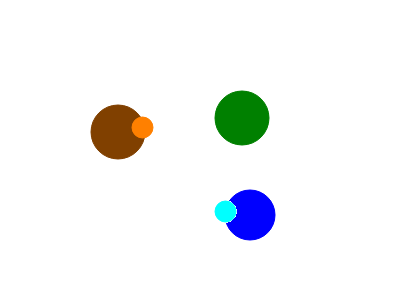
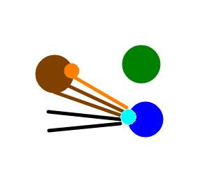

# Cow Simulator

## References

[Proximal Policy Optimization Algorithms](https://arxiv.org/abs/1707.06347)

[Multi-agent actor-critic for mixed cooperative-competitive environments](https://arxiv.org/pdf/1706.02275.pdf)

[Control a cart](https://pytorch.org/tutorials/intermediate/reinforcement_q_learning.html)

[Overcoming catastrophic forgetting in neural networks](https://www.pnas.org/content/114/13/3521.abstract)

[Emergent Tool Use From Multi-Agent Autocurricula](https://arxiv.org/pdf/1909.07528.pdf)

[Youtube Playlist I got my inspiration from](https://www.youtube.com/watch?v=xukp4MMTTFI&list=PL58qjcU5nk8u4Ajat6ppWVBmS_BCN_T7-&index=1 "Youtube Playlist Inspiration")

## Topic
This project includes different Reinforcement Learning strategies in a dynamic, multi-agent environment. <!-- TODO: define it more precisly-->

## Type
The type of this project is **Bring your own data** for reinforcement learning projects, because it provides a new environment for reinforcement learning strategies. Additionally it includes basic neural networks for every actor and learning algorithms for them. It is also partly **Beat the classics** as it is tested against rule based systems with path finding algorithms. 

## Summary
### Description

This project consists of a simulation that simulates a partially observable, multi-agent, stochastic, dynamic, continuous and unknown (no knowledge about laws of physics) environment.
It is designed that way so deep learning has to be used to find solutions and no simple algorithm (e.g. progression planning) can be used.

There are two different groups of actors that can interact consciously with the environment: cows and wolves. 
Additionally, there is another entity called grass. Each actor has a certain energy level. If the energy level of a cow or a wolf drops below zero, it dies. 
Cows and wolves have perceptors in order to obtain a partial observation of the environment.

The following figure shows a visualisation of the actors, the green circle represents grass, the brown circle represents a cow and the blue circle represents a wolf. The little circles represent their perceptors.

If an actor wants to perceive its environment, its perceptor sends out rays with a limited reach. The rays return the color of the actor/perceptor they first intersect with or black if they do not intersect with another actor. The next figure shows a visualisation of the rays. The color of the rays show the value they return.

Every entity has energy, if the energy drops below zero the entity vanishes. The cow gets energy by touching grass, the wolf by touching cows. Each entity loses energy by touching its counterpart or moving around. The goal of each actor is to obtain as much energy as possible. Grass gets more energy if it is left alone.

### Dataset
There is no real dataset. The project implements the environment, gives an visualisation of the state of the world and implements rule based actors.

### Work-Breakdown structure

| Individual Task &nbsp;                                     | Time estimate &nbsp; | Time used |
|------------------------------------------------------------|----------------------|-----------|
| research topic and first draft                             | 5h                   | 8h        |
| building environment                                       | 10h                  |           |
| designing and building an appropriate network &nbsp;&nbsp; | 20h                  |           |
| fine-tuning that network                                   | 10h                  |           |
| building an application to present the results             | 5h                   |           |
| writing the final report                                   | 10h                  |           |
| preparing the presentation of the project                  | 5h                   |           |

