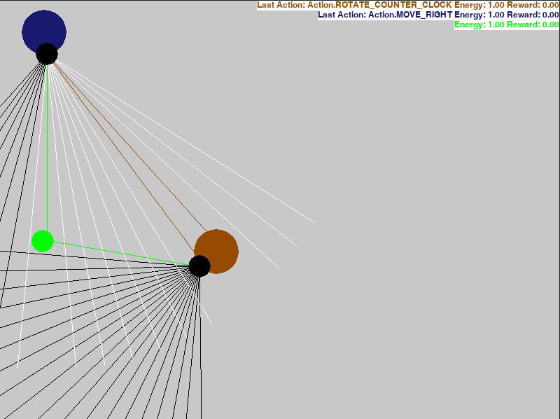
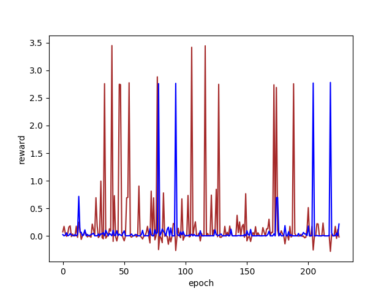
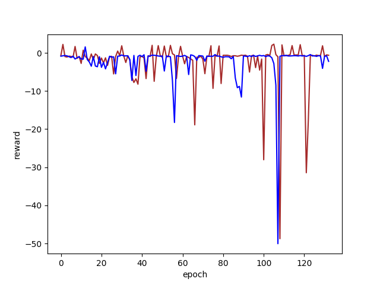
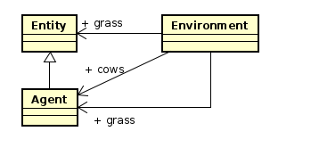

# Cow Simulator

## References

### scientific papers

[Proximal Policy Optimization Algorithms](https://arxiv.org/abs/1707.06347)

[Overcoming catastrophic forgetting in neural networks](https://www.pnas.org/content/114/13/3521.abstract)

### articles/tutorials that were used in preparation

[Control a cart](https://pytorch.org/tutorials/intermediate/reinforcement_q_learning.html)

[Youtube Playlist I got my inspiration from](https://www.youtube.com/watch?v=xukp4MMTTFI&list=PL58qjcU5nk8u4Ajat6ppWVBmS_BCN_T7-&index=1 "Youtube Playlist Inspiration")

[Multi-agent actor-critic for mixed cooperative-competitive environments](https://arxiv.org/abs/1706.02275)

[Emergent Tool Use From Multi-Agent Autocurricula](https://arxiv.org/abs/1909.07528)

[When Worlds Collide: Simulating Circle-Circle Collisions](https://gamedevelopment.tutsplus.com/tutorials/when-worlds-collide-simulating-circle-circle-collisions--gamedev-769)

[Quick Tip: Use Quadtrees to Detect Likely Collisions in 2D Space](https://gamedevelopment.tutsplus.com/tutorials/quick-tip-use-quadtrees-to-detect-likely-collisions-in-2d-space--gamedev-374)

## Topic
This project includes a Reinforcement Learning strategy in a dynamic, multi-agent environment. <!-- TODO: define it more precisly-->

## Type
The type of this project is **Bring your own data** for reinforcement learning projects, because it provides a new environment for reinforcement learning strategies. 
Additionally it includes basic neural networks for every actor and learning algorithms for them.

## Summary
### Description

This project consists of a simulation that simulates a partially observable, multi-agent, dynamic, continuous in space, discrete in time and partly unknown (missing knowledge about laws of physics) environment.

There are two actors that can interact consciously with the environment: a cow and wolf. 
Additionally, there is another entity called grass. 
Each entity has a certain energy level.
The cow gets energy by touching grass, the wolf by touching cows.
Each entity loses energy by touching its counterpart or moving around.
The goal of each actor is to obtain as much energy as possible.
If the energy level of a cow drops below zero the wolf wins, if the energy of the grass drops below zero the cow wins.
An actor perceives its environment, by sending out rays with a limited reach. 
The rays return the color of the actor they intersect with, black if they intersected with the game border or white if they did not intersect with anything.
The next figure shows a visualisation of the rays, the cow (brown), the wolf (blue), the grass (red) and a visualisation of the rays.

The little black circles represent their head.

To implement the actors' AI deep Q learning as described in the lecture was used, however it does not achieve wanted results as of yet.

### Dataset
There is no real dataset. The project implements the environment and a deep q learning algorithm for the actors and gives an visualisation of the state of the world.

### Error metric
A multi agent environment has no intuitive error metric as it is a zero-sum game.
If one agent wins the other looses.
However if the agents algorithm produce a reasonable behaviour the agents should obtain more rewards on average than if they behaved randomly.
Therefore the energy gain was chosen as metric and the goal was to have a average reward of above 0.5 for both the wolf and the cow.
The agents did not behave reasonable, they mostly moved to one border and stayed there.
This can be observed in the following graph, as the reward just fluctuates in this case.

In oder to get better results a negative reward was added if an agent hits the border.
In the next figure the reward graph can be seen, the brown line represents the average cow reward per epoch and the blue graph the wolf reward per epoch.

As the border collision count is interesting as well it was also captured and plotted.
The goal was to have an average collision count of 5.
As seen in the following plot both agents learnt to avoid borders in certain epochs.
The exploration rate goes down with each epoch, so agents rely more on their neuronal network in latter epochs.

### Documentation

### Work-Breakdown structure

| Individual Task &nbsp;                                     | Time estimate &nbsp; | Time used |
|------------------------------------------------------------|----------------------|-----------|
| research topic and first draft                             | 5h                   |  8h       |
| building environment                                       | 10h                  |  14h      |
| setting up cuda, cudnn... on manjaro                       | 20m                  |  21h      |
| designing and building an appropriate network &nbsp;&nbsp; | 20h                  |  4h       |
| fine-tuning that network                                   | 10h                  |  7h       |
| building an application to present the results             | 5h                   |           |
| writing the final report                                   | 10h                  |           |
| preparing the presentation of the project                  | 5h                   |           |

